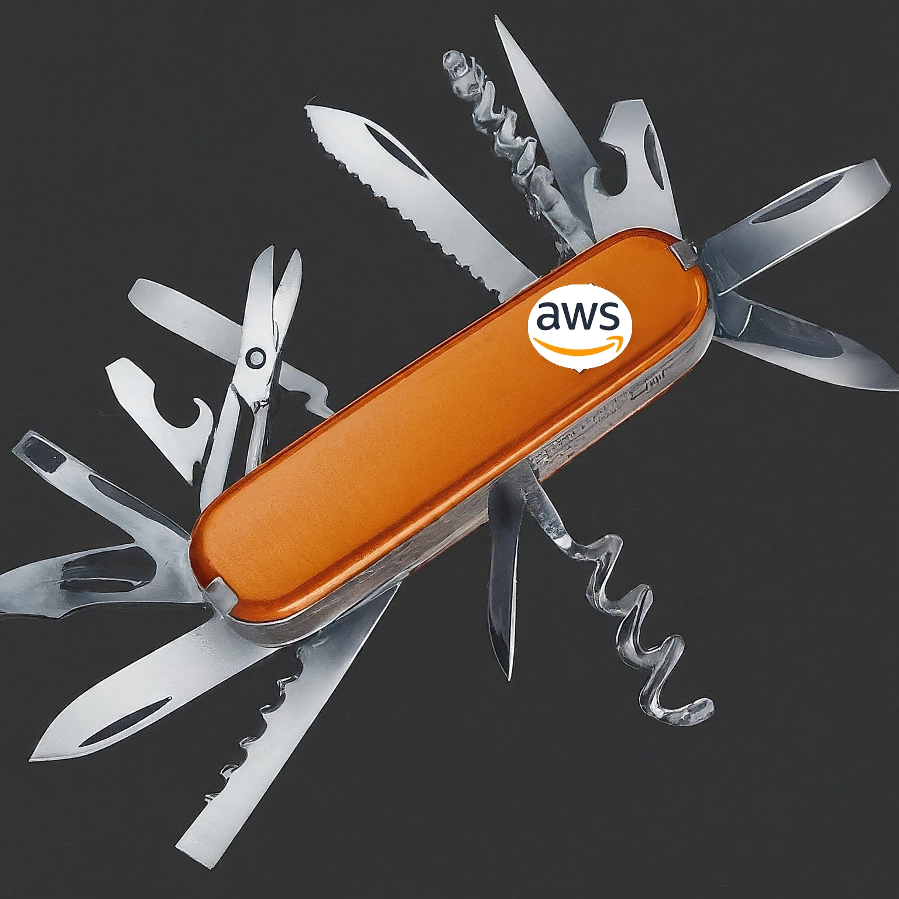

# AWS Swiss Army Knife
---

Tips & Tricks for the AWS CLI commands and JSON query combinations for precise data extraction sometimes using a little of Shell scripting for automation, orchestration and gathering information

    

## EC2

> For AWS EC2 check de file [EC2](ec2/README.md)

## Bucket S3

> For AWS S3 check the [S3 README](s3-bucket/README.md).

## Lambdas

> For tips and tricks with AWS Lambdas check the [lambda](lambda/README.md) directory.

## IAM

Following bellow the commands by type

### User

> For IAM User tips and tricks check the [IAM/User](iam/user/README.md).

### Role

> For IAM Role tips and tricks check the [IAM/Role](iam/role/README.md).

### Policy

> For IAM Policy tips and tricks check the [IAM/Policy](iam/policy/README.md).

